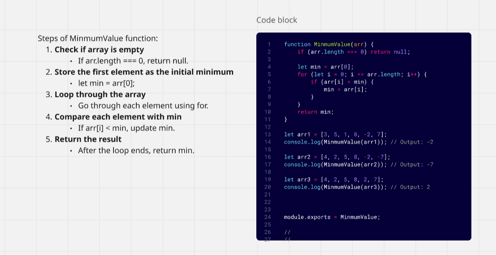

## Challenge 2: Minimum Value

## Description 
Create a function that determines the smallest value in a given array of numbers. The function should handle cases where the array is empty by returning null, and otherwise it should go through each element to find and return the minimum value

## Whiteboard
