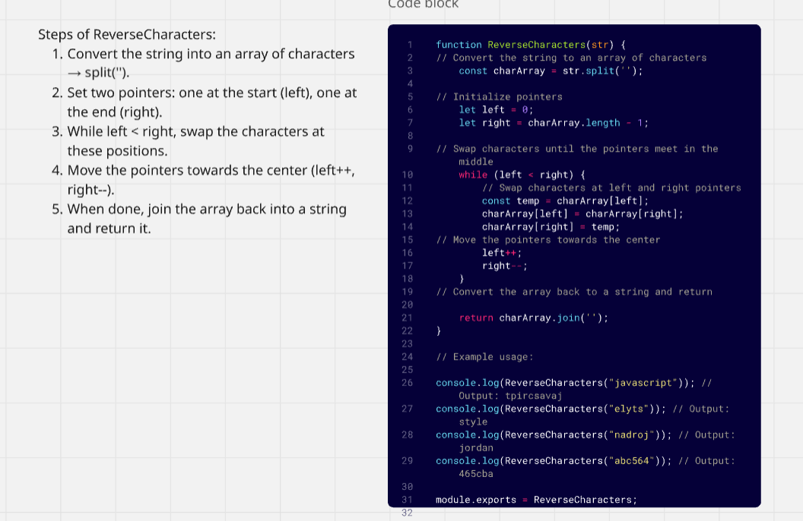
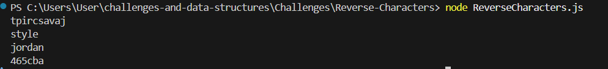

## Reverse Characters

## description
Create a function that takes a string as input and returns a new string with its characters reversed. The function should work by swapping characters from both ends of the string until it reaches the middle, then return the reversed result.

## whiteboard 

## Console output
