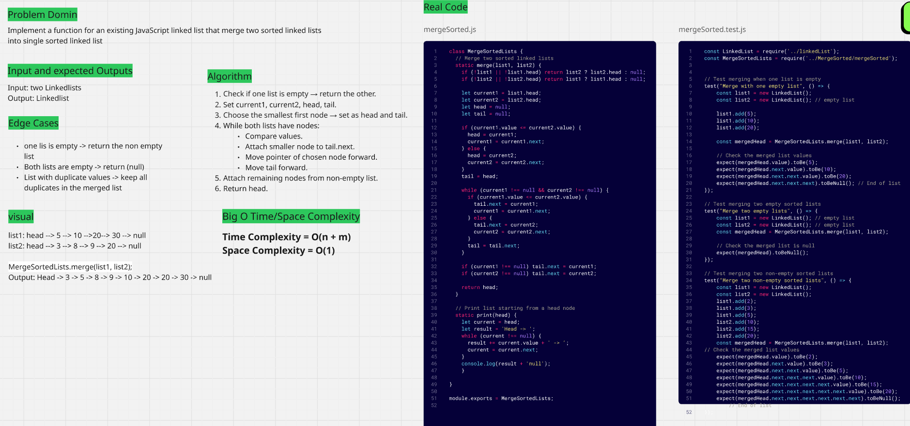

# Problem: Merging Sorted Linked Lists

This project offers a solution to a common computer science problem: implementing a function in existing JavaScript that merges two sorted linked lists into a single sorted linked list.

---

---

The provided image acts as a detailed guide, covering everything from problem definition and edge cases to time and space complexity. This approach ensures clarity and enables quick understanding of the solution's logic and efficiency.