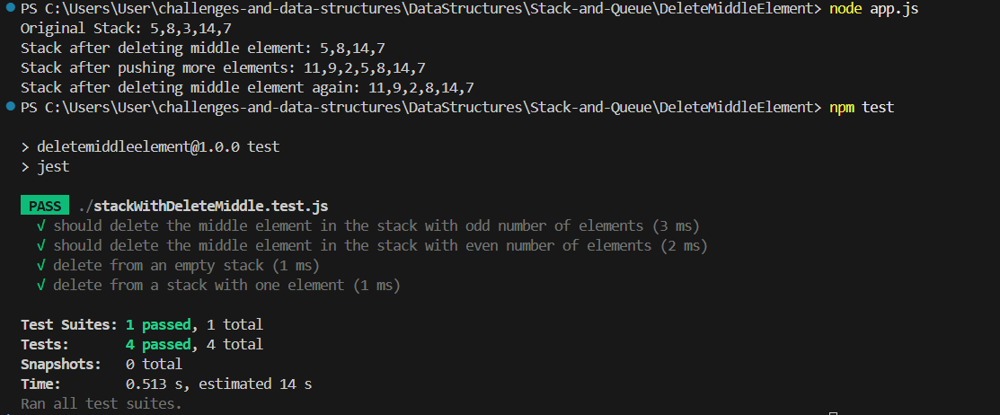

### Delete Middle Element of a Stack

# Problem Domain: Implement a method to delete the middle element of a stack in javascript.

# Input and Expected Outputs: 
 1. Input: Stack
 2. Output: Stack

# Edge Cases: 
 1. if the stack has an even number of elements remove the lower middle element.
 2. if the stack is empty, return null.
 3. if the stack has an one number of elements remove the element.

# Visual:

# Algorithm:
 1. Check if the stack is empty
        If the stack has no elements, there’s nothing to delete, so the function returns null.
 2. Handle the case with only one element
        If the stack has only one element, remove it using pop() and return it.
 3. Calculate the middle index
        If the stack size is even, the middle is taken as (n / 2 - 1) (0-based index).
        If the stack size is odd, the middle is Math.floor(n / 2).
 4. Use a temporary stack to hold elements above the middle
        Pop elements from the original stack until we reach the middle element.
        Push these popped elements onto a temporary stack to keep them safe.
 5. Remove the middle element
        The element at the middle index is now at the top of the stack. Remove it using pop().
 6. Restore the elements from the temporary stack
        Pop elements from the temporary stack and push them back onto the original stack.
        This restores the order of the elements above the middle.
 7. Return the modified stack
        The stack now has its middle element removed, with the order of all other elements preserved.

# Real Code:
 

# Big O Time/Space Complexity:
 1. Time Complexity : O(n)
 2. Space Complexity : O(n)

# Console Outputs:

