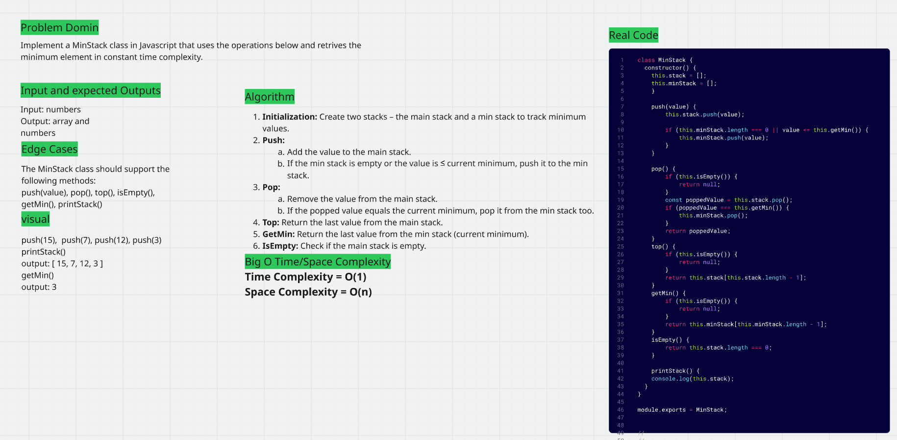

# Problem: MinStack

This project provides an implementation of a MinStack data structure.
The goal is to support standard stack operations (push, pop, top, isEmpty) while also allowing retrieval of the minimum element in the stack in constant time.

The MinStack achieves this by maintaining an auxiliary stack to keep track of minimum values as elements are added or removed.
Edge cases such as popping or peeking from an empty stack are handled gracefully.

The provided image serves as a comprehensive guide, covering all aspects from problem definition and edge cases to time and space complexity. This approach ensures clarity and allows for a quick understanding of the solution's logic and efficiency.

# output console screenshoot
