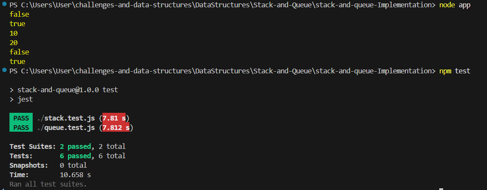

# Problem: stack

This project provides an implementation of a stack data structure. The goal is to allow adding elements to the top, removing the top element, and viewing the top element efficiently. Edge cases such as popping or peeking from an empty stack are handled gracefully. All operations have constant time and space complexity.

---

---

The provided image serves as a comprehensive guide, covering all aspects from problem definition and edge cases to time and space complexity. This approach ensures clarity and allows for a quick understanding of the solution's logic and efficiency.

# problem: queue

This project provides an implementation of a queue data structure. The goal is to allow adding elements to the rear, removing elements from the front, and viewing the front element efficiently. Edge cases such as dequeuing or peeking from an empty queue are handled gracefully. All operations have constant time and space complexity.

---

---

The provided image serves as a comprehensive guide, covering all aspects from problem definition and edge cases to time and space complexity. This approach ensures clarity and allows for a quick understanding of the solution's logic and efficiency.

# console-output
