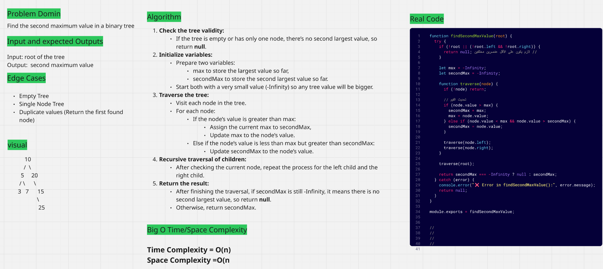
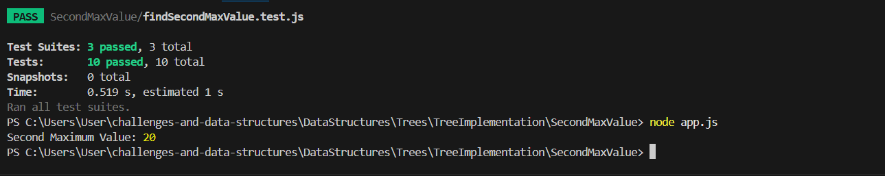

# Problem: Second Maximum in Binary Tree

This project implements a recursive algorithm to find the second largest value in a binary tree.
It uses a Depth-First Search (DFS) traversal to explore all nodes while keeping track of the max and secondMax values.
The solution safely handles cases like empty trees or trees with only one unique value, and is written in a clean, modular, and testable way.

The provided image serves as a comprehensive guide, covering all aspects from problem definition and edge cases to time and space complexity. This approach ensures clarity and allows for a quick understanding of the solution's logic and efficiency.

