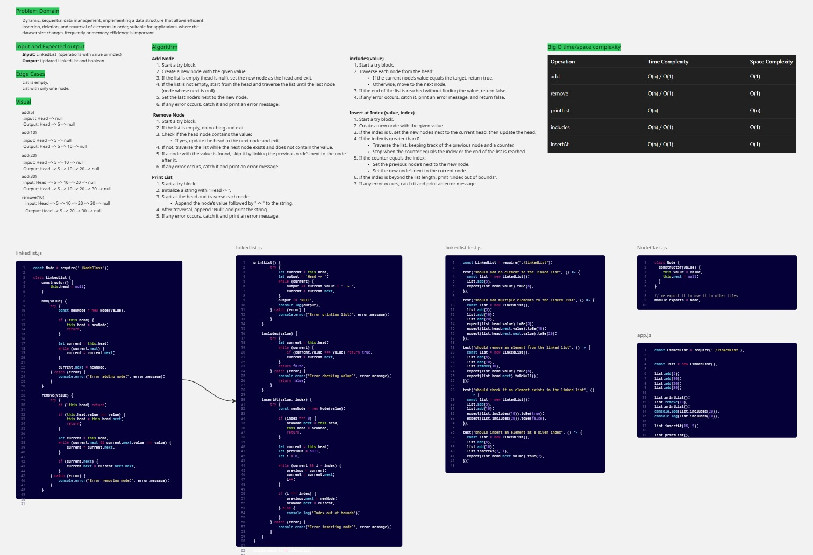
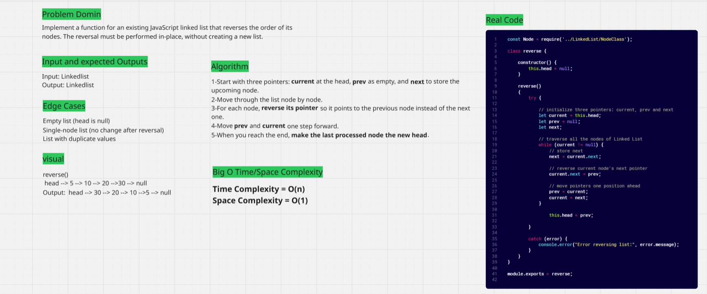
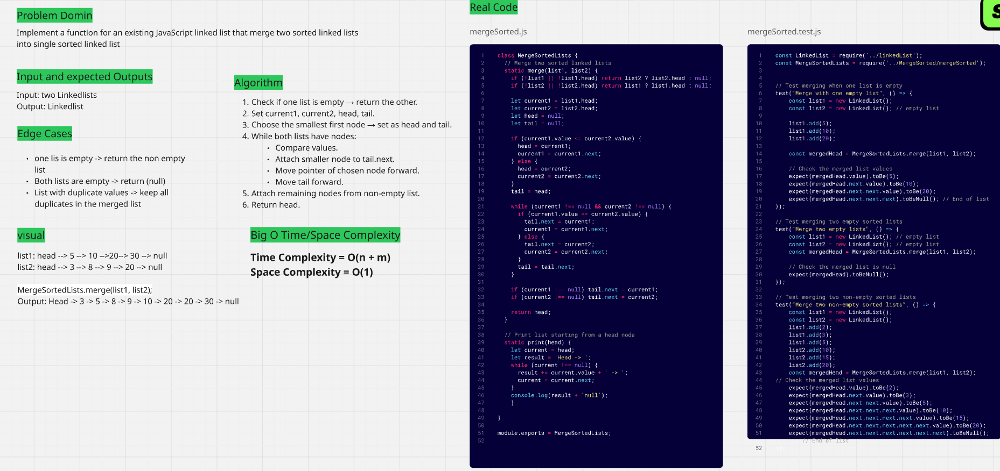
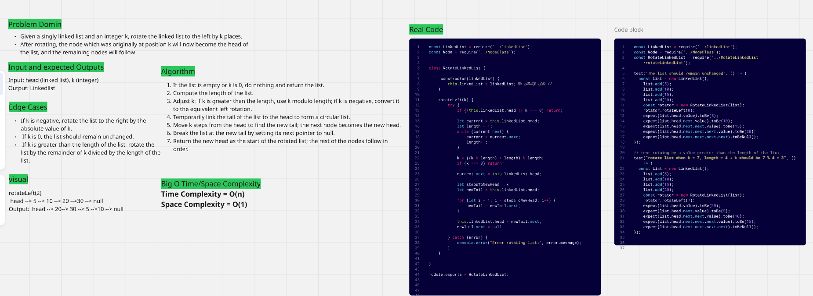
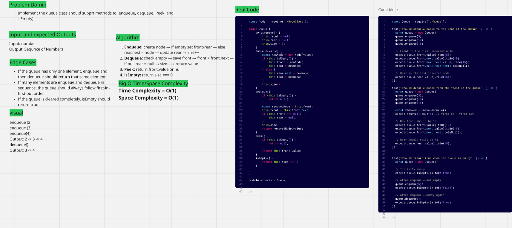
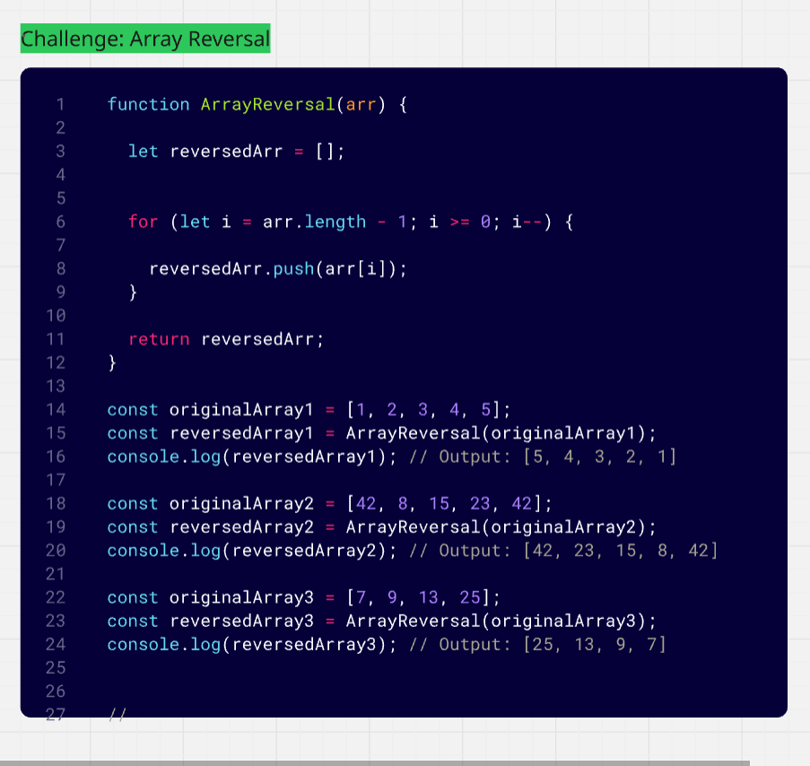
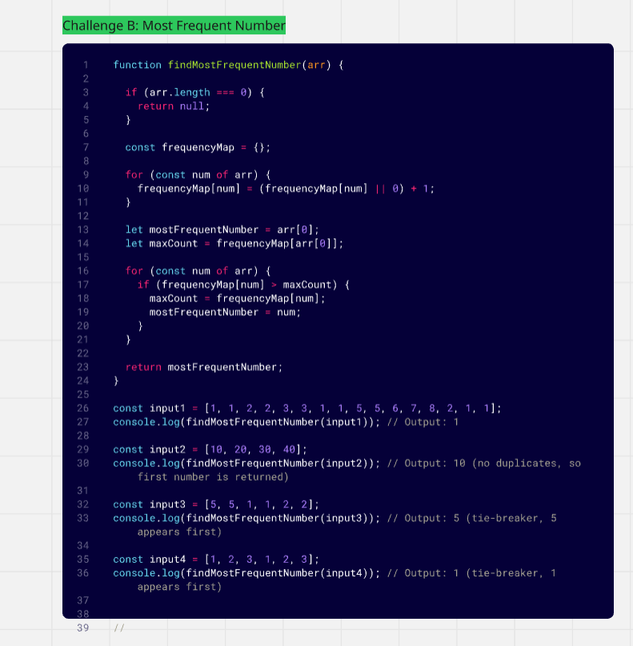

### challenges-and-data-structures

### data-structures

1. ### LinkedList 

2. ### Reverse LinkedList

3. ### Merging Sorted Linked Lists

4. ### Linked List Rotate by k

5. ### Stack

6. ### Queue

### challenges

1. ### Whiteboard Images

### Challenge A: Array Reversal

### Challenge B: Most Frequent Number

2. ### Minimum Value

