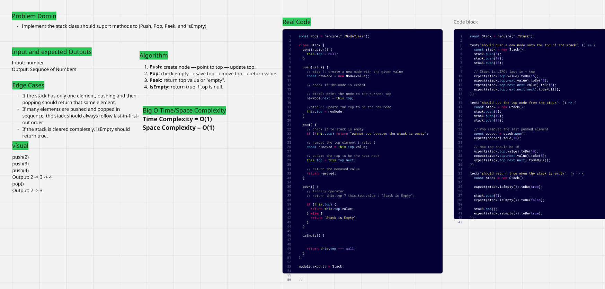
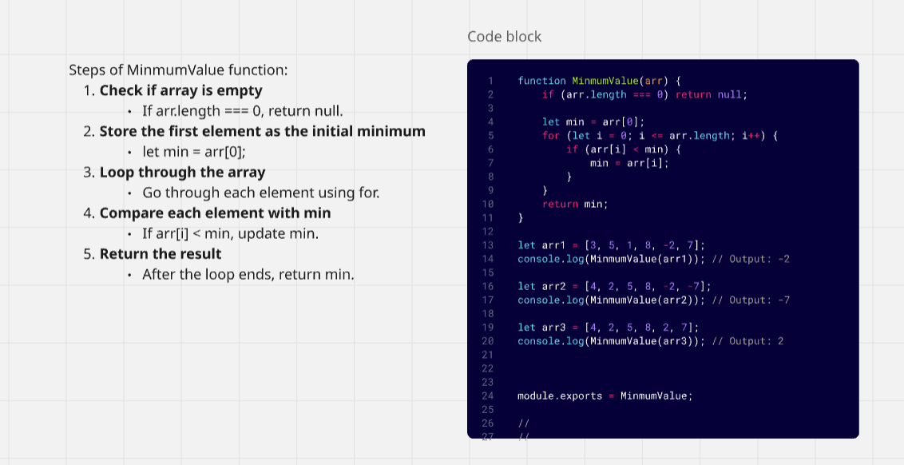

### challenges-and-data-structures

### data-structures

1. ### LinkedList 

2. ### Reverse LinkedList

3. ### Merging Sorted Linked Lists

4. ### Linked List Rotate by k

5. ### Stack

6. ### Queue

7. ### Min Stack

8. ### Delete Middle Element
[Delete Middle Element](DataStructures/Stack-and-Queue/DeleteMiddleElement/README.md)

9. ### Binary Tree & Binary Search Tree
[Binary Tree & Binary Search Tree](DataStructures/Trees/TreeImplementation/docs/whiteboard-BT-BST.png)

10. ### Second Maximum in Binary Tree

11. ### Binary Tree - Sum of leaf nodes

### challenges

1. ### Whiteboard Images

### Challenge A: Array Reversal

### Challenge B: Most Frequent Number

2. ### Minimum Value

3. ### Reverse characters
